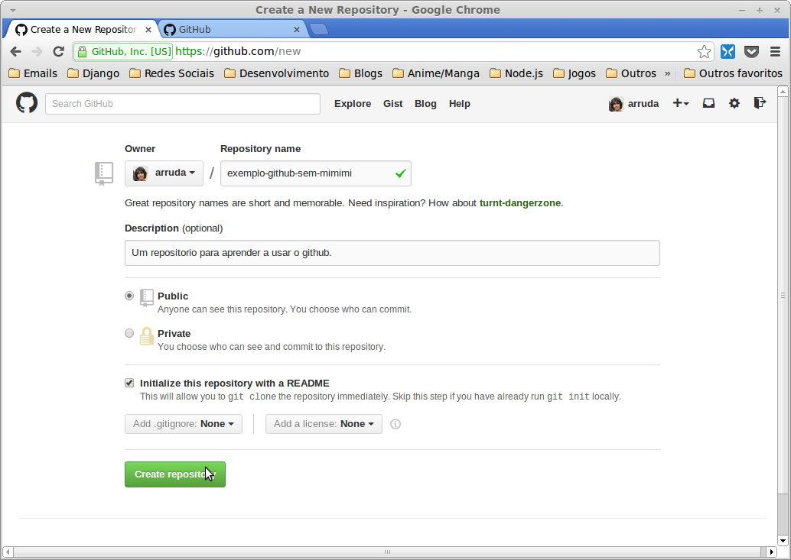
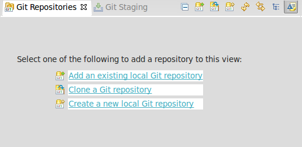
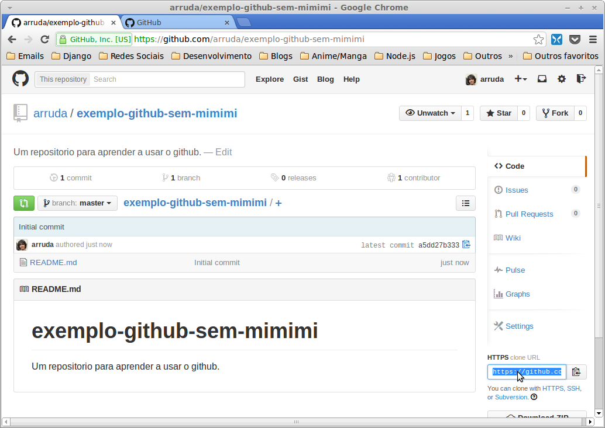
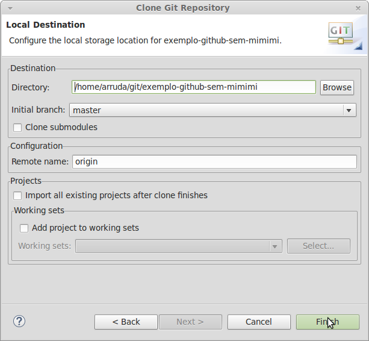
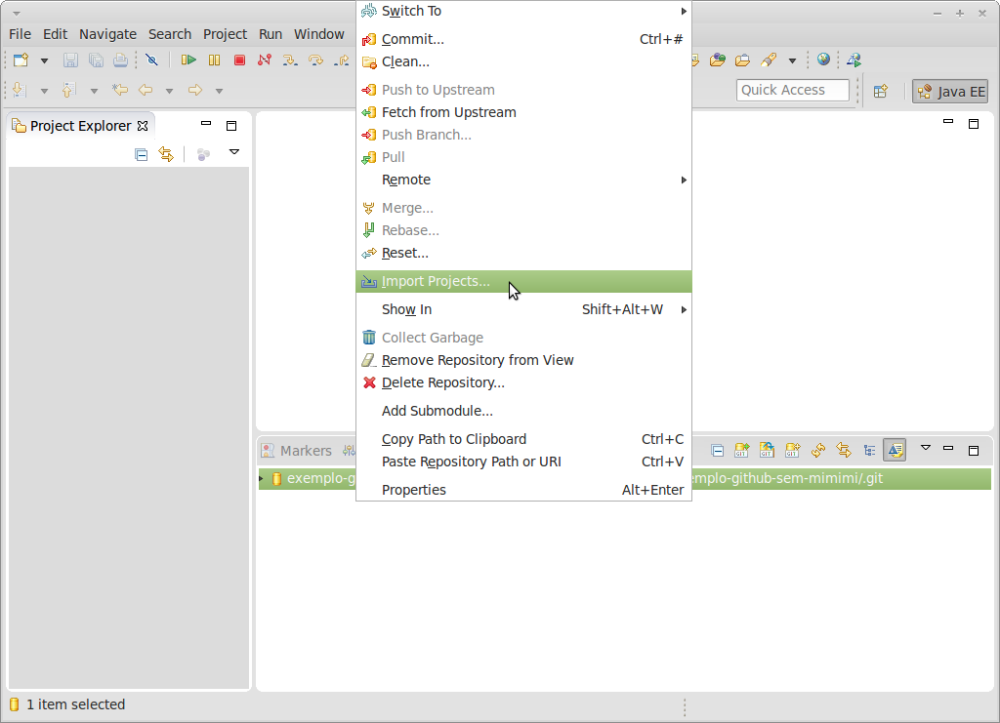

# Prática

## Criando um Repositório no Github

Uma vez feito o login no Github, podemos criar um novo repositório de um projeto facilmente clicando em **[+ New Repository]**, localizado no canto inferior direito da tela, conforme a imagem abaixo:

Na tela seguinte colocamos os dados do novo repositório:

* nome
* descrição

E selecionamos a *checkbox* **initialize this repository with a README**. O que essa opção faz é que ao invés de ter um repositório vazio, ele criará um repositório já com um commit responsavel por criar um arquivo README com os dados de nome e descrição do projeto. Isso é algo que agiliza um pouco as coisas. Em seguida clicamos em **[Create Repository]**

A imagem abaixo é um exemplo de como pode ser preenchido esses campos:

## Clone do Repositório

Agora que já temos um repositório **remoto** (o repositório que acabou de ser criado no Github), podemos fazer um **clone** dele localmente.

Mas antes disso precisamos selecionar algumas janelas no Eclipse para realizar essas operações.

### Habilitando Janelas do Egit

Selecionamos no menu **Window->Show view->Other...**:

Na janela que abrir digitamos **git** para filtrar as janelas disponiveis, e escolhemos as opções:

* Git Repositories
* Git Staging

### Usando Egit Para Clonar o Repositório

Na nova janela, recém incluida, **Git Repositories** clicamos na opção **Clone a Git Repository**.

Para o próximo passo, precisamos pegar o endereço do repositório git que criamos no Github, para isso, vá na pagina do novo repositório e copie o endereço de **HTTPS** (não usar o SSH, já que para utiliza-lo seria necessário outras configurações mais avançadas). A figura abaixo mostra onde se encontra esse link:

Agora colocamos no primeiro campo (**URI**) colocamos o link do repositório git que criamos no Github.

Automaticamente os outros campos irão ser preenchidos, faltando apenas os campos relativos a **Autenticação**.

No campo **user** coloque seu usuário do Github, e no campo **password** coloque sua senha, e clique em **[Next]**.

Na próxima janela temos a opção de quais branches iremos trazer baixar neste clone, como temos apenas nosso branch padrão (o branch **master**) não precisamos mudar nada nesta tela.

Na próxima tela temos uma série de opções, mas podemos ignorar todas elas, e apenas considerar uma: **Directory**.
Nesta opção selecionamos onde vai ser clonado o repositório localmente. Se não quiser, pode deixar neste local por padrão, isso fica a gosto de cada um. Por fim clicamos em **[Finish]**.

Feito isso, podemos ver que agora temos localmente um clone do repositório git que criamos no github.

### Criando um Projeto no Eclipse a Partir do Repositório Local

O que temos agora não é ainda um projeto no eclipse, portanto não podemos utilizar as facilidades da IDE para trabalhar nesse repositorio recém clonado. Isso é: Temos o repositório na nossa máquina mas ele ainda não foi importado como um projeto do Eclipse.

Para isso vamos clicar com o botão direito no repositório e selecionar a opção **Import Projects...**:

Na próxima janela selecionamos a opção **Import as General Project** e clicamos em **[Next]**:

Na janela seguinte, se quisermos, podemos trocar o nome do projeto. Por fim clicamos em **[Finish]**

Agora tornamos nosso repositório em um projeto do Eclipse:

## Commits Locais
## Push
## Pull
## Contribuindo

