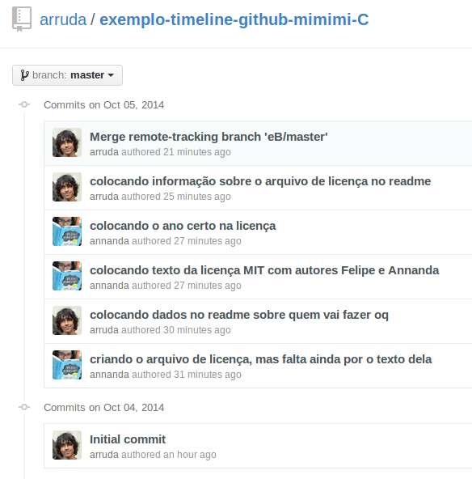

# Visão Geral de GIT

## O que é?

* Um VCS (Version Control System)
* Rápido e Moderno
* Facilita alterações colaborativas
* Pode ser usado para qualquer tipo de "Trabalho de Conteúdo"
* Distribuído e Local (conectividade não impede o versionamento do trabalho)

## Trabalhos Individuais

Existem necessidades básicas como:

* Manter o **histórico** de alterações (chamados de Commits):
    * O que foi alterado;
    * Quando foi alterado;
    * Por que foi alterado;
* **Revisar** Alterações:
    * Desfazer alterações;
    * Voltar para uma alteração;
    * Criar ramificações nas alterações (chamados Branches)

## Trabalhos Coletivos

Além das necessidades presentes em trabalhos individuais, em trabalhos coletivos existem as seguintes necessidades:

* Identificação:
    * Quem fez a alteração;
* Juntar Alterações:
    * Juntar alterações de todos os colaboradores (chamado Merge);

## Teoria vs Prática

### Teoria

Na teoria é simples, temos aqui dois exemplos, onde Felipe e Annanda cada um está fazendo uma parte de um trabalho.

Assim cada um tem uma tarefa:
* Felipe irá fazer o arquivo README e
* Annanda fará o arquivo de Licença de software livre.

Se formos ver a linha do tempo dos commits (alterações) de Felipe teremos algo do tipo:

#### Linha do tempo do Felipe:

#### Linha do tempo da Annanda:

### Prática

Na prática as coisas são um pouco mais complexas, pois temos:

* Pessoas fazendo alterações em paralelo;
* Pessoas fazendo alterações em horários diferentes;

Como fica esse histórico e a linha do tempo se não podemos perder as informações do que cada um fez e temos que juntar isso de alguma forma?!

#### Linha do tempo do Merge de Felipe e Annanda:

## Principais Etapas no Git